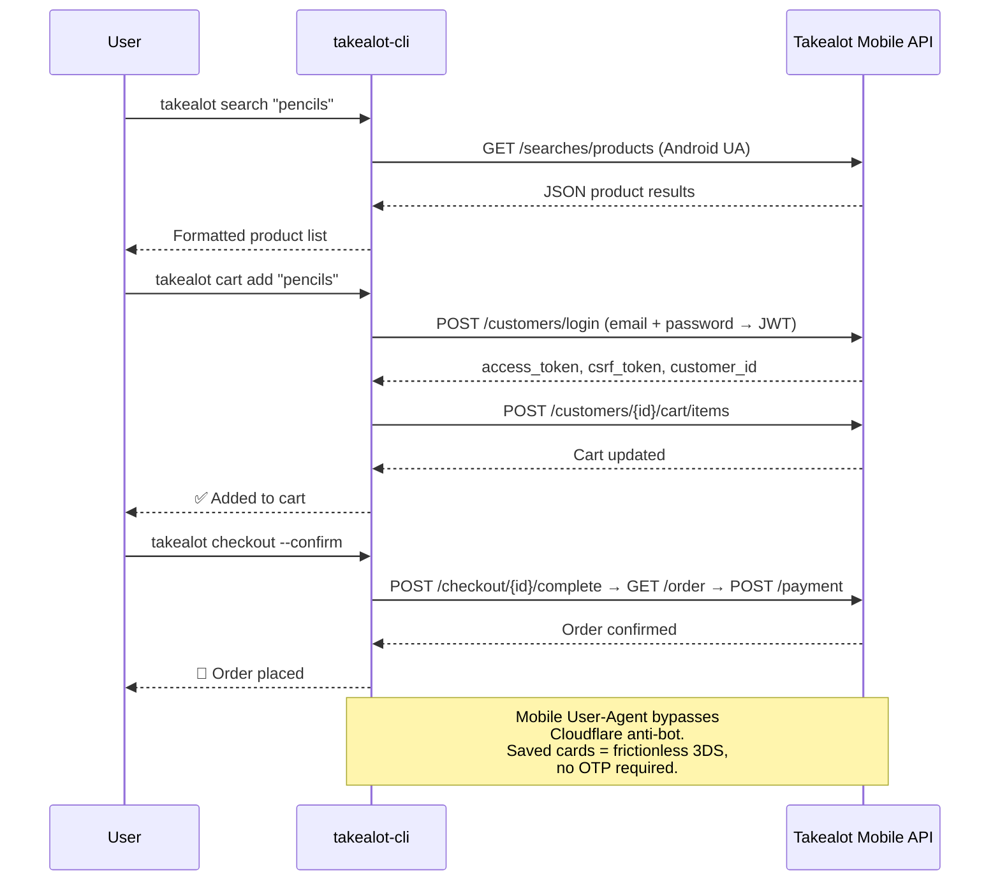
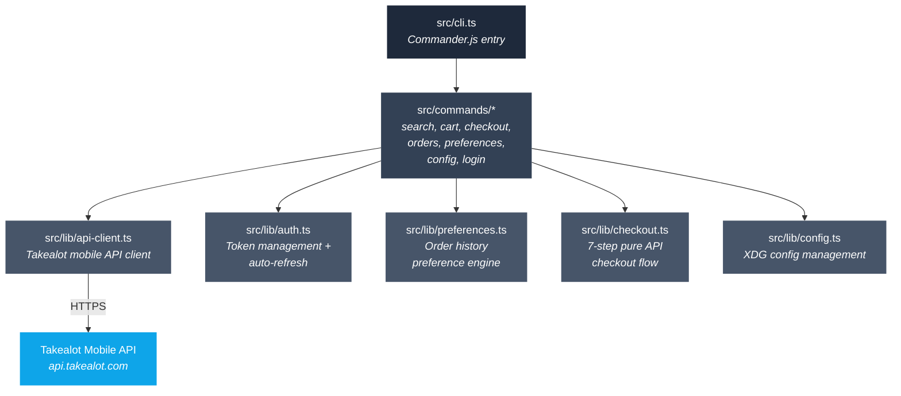

<h1 align="center">takealot-cli</h1>

<p align="center">
  Search, cart, and checkout on Takealot.com from the command line.<br/>
  Pure API. No browser. No Playwright.<br/><br/>
  Built by <a href="https://github.com/yashiels">@yashiels</a>
</p>

<p align="center">
  <a href="https://github.com/yashiels/takealot-cli/blob/main/LICENSE"></a>
  = 18" />
  
</p>

---

## Why

Takealot's website is slow, the app is bloated, and neither is scriptable. This CLI talks directly to the mobile API — the same endpoints the Android app uses. One command to search, add to cart, or check out. Pipe to `jq`, wire into a cron job, or call from your own code.

## Install

```sh
git clone https://github.com/yashiels/takealot-cli.git
cd takealot-cli
npm install
npm run build

# Run directly
node dist/cli.js search "pencils"

# Or link globally so 'takealot' works anywhere
npm link
takealot search "pencils"
```

> **Note:** Not yet published to npm. For now, clone and `npm link` to get the global `takealot` command.

## Quick Start

```sh
# Search products (no login required)
takealot search "protein powder"

# JSON output — pipe to jq, feed to scripts
takealot search "pencils" --json

# Add items to cart (prompts for login on first use)
takealot cart add "3 pencils"

# Add a whole shopping list at once
takealot cart basket "milk; bread; eggs; coffee"

# View your cart
takealot cart

# Dry-run checkout (shows totals, does NOT pay)
takealot checkout

# Actually place the order
takealot checkout --confirm
```

### Example output

```
🔍 "pencils" (246 results)

1. BIC Ecolutions Evolution 655 HB Pencils (Blister of 3+2)
   R 29  ✓ in stock  Bic
   id 29815531

2. BIC Ecolutions Evolution 650 HB Pencils (Blister of 6+4)
   R 52  ✓ in stock  Bic
   id 29815529

3. STAEDTLER Tradition ECO HB Pencils - 180T- HB Box of 12
   R 109  ✓ in stock  Staedtler
   id 93645874
```

## How It Works



All endpoints captured via MITM proxy on the official Android app. The mobile User-Agent bypasses Cloudflare anti-bot protection. Saved card tokens give frictionless 3DS — no OTP, no manual intervention.

## Command Reference

| Command | Description |
|---------|-------------|
| `takealot search <query>` | Search products (no login required) |
| `takealot cart` | Show current cart contents |
| `takealot cart add <item>` | Search and add item to cart (preference-aware) |
| `takealot cart basket <items>` | Add multiple items (`;` `,` or newline separated) |
| `takealot cart clear` | Empty the entire cart |
| `takealot checkout` | Dry-run checkout (shows totals, stops before payment) |
| `takealot checkout --confirm` | Place the order and pay with saved card |
| `takealot orders` | List recent orders |
| `takealot orders show <id>` | Full details for one order |
| `takealot preferences refresh` | Rebuild brand preference cache from order history |
| `takealot config` | Show config and credential status |
| `takealot login` | Force re-login (rotates cached tokens) |
| `takealot --help` | Show help |
| `takealot --version` | Show version |

### Global Flags

| Flag | Description |
|------|-------------|
| `--json` | Machine-readable JSON to stdout |
| `--verbose` | Debug logging to stderr |
| `-V, --version` | Print version |
| `-h, --help` | Show help |

### Exit Codes

| Code | Meaning |
|------|---------|
| `0` | Success |
| `1` | General failure (network error, API error, auth failure) |
| `2` | Partial failure (some items in a basket add failed) |

## Preference Engine

When adding items to cart, the CLI picks the best product match using your order history:

1. **Exact match** — you've ordered this exact product before → pick it
2. **Brand match** — same brand you've bought in this category → prefer it
3. **Preferred brands** — explicit brand list in config → boost ranking
4. **Jaccard similarity** — fuzzy title matching for everything else

Run `takealot preferences refresh` after first login to seed the cache from your past orders.

## Configuration

Config lives in `~/.config/takealot-cli/`:

| File | Contents |
|------|----------|
| `config.json` | API base URLs, platform, preferred card |
| `credentials.json` | Email, tokens (auto-managed) |
| `preferences.json` | Order history preference cache |
| `preferred-brands.json` | Explicit brand preference list |

On first authenticated command, you'll be prompted for your Takealot email and password. Tokens auto-refresh — you rarely need to re-login.

## Architecture



## Roadmap

- [x] Product search (unauthenticated)
- [x] Cart management (add, basket, clear, view)
- [x] Pure API checkout with saved card (frictionless 3DS)
- [x] Order history
- [x] Brand preference engine from order history
- [x] JSON output for scripting
- [x] XDG config management
- [x] Auto token refresh
- [ ] `takealot watch <order-id>` — poll order status until delivered
- [ ] Wishlist management
- [ ] Deal alerts / price tracking
- [ ] Publish to npm (`npm install -g takealot-cli`)

## Contributing

```sh
git clone https://github.com/yashiels/takealot-cli.git
cd takealot-cli
npm install
npm run build
npm run lint
```

## Disclaimer

This project is not affiliated with, endorsed by, or sponsored by Takealot.com. Takealot is a registered trademark of Takealot Online (Pty) Ltd. This tool uses private mobile API endpoints reverse-engineered from the official Android application. Use at your own risk.

## License

[MIT](LICENSE) — Yashiel Sookdeo
