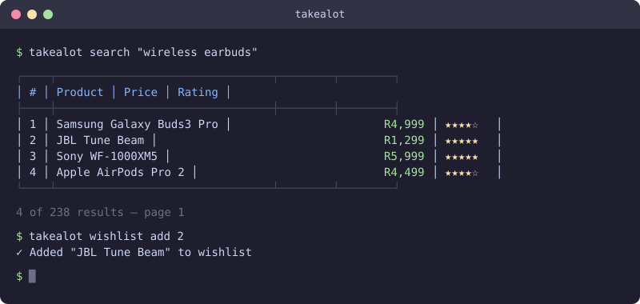

# 🛒 takealot-cli

**The Takealot store from your terminal — built for headless agents.**

[](https://github.com/yashiels/takealot-cli/actions/workflows/ci.yml)
[](LICENSE)
[](https://github.com/yashiels/takealot-cli/releases/latest)

Search, browse, cart, check out, track orders, returns, wishlists, credits, Takealot Plus, account — the whole app, driven from the command line and, above all, by **autonomous agents**. Pure REST: it talks directly to the Takealot Android mobile API (the user-agent that bypasses Cloudflare). No browser, no Playwright, no Puppeteer.

Every one of the app's **192 shoppable endpoints** is wired to a command, and every data command speaks `--json`.



## Why it's different: it actually works headless

Authenticated shopping used to be impossible without a human at a terminal — a token refresh failure cascaded into a 2FA prompt nothing could answer. Not any more:

- **Device trust.** The CLI persists the server-assigned device id (`did`) and replays it on every request (exactly as the Android app does). **Complete 2FA once, and every login after that — including a full re-login after tokens are wiped — skips the OTP.**
- **TTY-free OTP.** First-time 2FA is a two-step handshake an agent can drive: trigger the challenge, obtain the code out-of-band, submit it in a second invocation.
- **Credential & OTP injection** via environment variables (1Password / `op-sa` friendly).
- **Safe by default.** Every state-changing command is a **dry-run** until you pass `--confirm`; secrets are recursively redacted from all output; payments are idempotent (no duplicate orders or charges).

## Install

```bash
brew install yashiels/tap/takealot
```

Or grab a standalone binary from the [latest release](https://github.com/yashiels/takealot-cli/releases/latest).

**Build from source** (Node ≥ 18):

```bash
git clone https://github.com/yashiels/takealot-cli.git
cd takealot-cli
npm install && npm run build
npm link          # puts `takealot` on your PATH
```

## Quick start

```bash
# No login needed for search
takealot search "protein powder" --json | jq '.[0]'

# Authenticate once (2FA prompts on first login; the device is trusted afterwards)
takealot login

# Find and cart
takealot info 52341565                 # product detail by PLID
takealot cart add --sku 80226511       # add an exact buyable
takealot cart add "3 pencils"          # or let the preference engine pick
takealot cart set-qty 80226511 2       # change quantity
takealot cart                          # show the cart

# Check out — dry-run by default (no charge)
takealot checkout                      # shows delivery address, options, ETA, fee, card, total
takealot checkout --confirm --yes      # place the order and pay with the saved card

# After the sale
takealot orders                        # recent orders
takealot orders track 217865628        # consignment tracking
```

## Headless / agent usage

The CLI is designed to run unattended. See the [agent skill](skill/SKILL.md) for the full playbook.

**Non-interactive credentials** (override any stored pair; op-sa / 1Password friendly):

```bash
TAKEALOT_EMAIL="$(op-sa read op://Agents/takealot/username)" \
TAKEALOT_PASSWORD="$(op-sa read op://Agents/takealot/password)" \
  takealot cart --json
```

**Two-step, TTY-free 2FA** (only needed until the device is trusted):

```bash
# 1. Trigger — sends the OTP to the user's phone, prints the challenge
takealot login --json
#    → {"status":"otp_required","challenge":"<nonce>","otpSentTo":"…","expiresInSec":300}
#    (if the device is already trusted this prints {"status":"ok","customerId":…} — done)

# 2. Submit the code (env or flags)
TAKEALOT_OTP=123456 TAKEALOT_CHALLENGE=<nonce> takealot login --json
# or: takealot login --otp 123456 --challenge <nonce> --json
```

After that first success the device is trusted: subsequent `login`s (and background re-logins) return tokens directly, no OTP. Machine-readable errors: `otp_required`, `otp_state_mismatch`, `otp_expired`, `rate_limited`.

## Command surface

Every data command accepts `--json`. State-changing commands are **dry-run by default** — add `--confirm` (and `--yes` to skip the prompt) to actually write.

| Group | Commands |
|-------|----------|
| **Find** (no login) | `search <q> [--limit] [--json]` · `autocomplete <q>` · `trending` · `info <plid>` · `deals` · `reviews <plid>` |
| **Recommend** | `recommend [--location]` · `buy-again` |
| **Cart** | `cart` · `cart add <q \| --sku <id> \| --plid <id>>` · `cart set-qty <sku> <n>` · `cart remove <sku>` · `cart basket "a; b; c"` · `cart clear` |
| **Delivery** | `address list \| use <id> \| add form\|submit \| update <id> form\|submit \| rm <id>` · `pickup-points` |
| **Checkout & pay** | `checkout` (dry-run preview) · `checkout --confirm` · `checkout resume <orderId>` · `checkout reset` · `cards [rm <ref>]` · `credits [redeem <code>]` |
| **Orders** | `orders [--limit]` · `orders show <id>` · `orders track <id>` · `orders cancel\|request-cancel\|reschedule` · `invoices <orderId>` |
| **Returns** | `returns …` · `refunds …` (cart → checkout flow, form/submit) |
| **Wishlist** | `wishlist [list \| items \| add <plid> \| rm <id> \| mk <name> \| move]` |
| **Plus** | `plus [state \| plans \| history \| savings \| signup \| cancel \| manage] form\|submit` |
| **Account** | `account [summary \| personal \| password \| security \| 2fa \| trusted-devices \| activity]` |
| **Reviews** | `myreviews [list \| reviewable \| add <tsin> \| rm <tsin>]` |
| **Help** | `help [topics \| topic <slug> \| search <q> \| chat …]` |
| **Meta** | `login [--otp --challenge \| --reset]` · `config [show]` · `preferences [show \| refresh]` |

Identifiers are explicit: `--plid` is the product-listing id (links, product detail); `--sku` is the buyable id that cart operations take. `--plid` on `cart add` is resolved to its SKU automatically.

### Data-section writes (form → submit)

Some writes (address, account, returns, Plus, reviews) use server-assembled forms. Fetch the layout, fill it, submit it:

```bash
takealot account password form                 # fetch + locally cache the form
# edit the JSON, keeping the section_id / field_id from the form
takealot account password submit --file filled.json --confirm
```

### Global flags

| Flag | Effect |
|------|--------|
| `--json` | Machine-readable JSON (every data command) |
| `--confirm` / `--yes` | Perform a write / skip the confirmation prompt |
| `--unsafe-raw` | Print unredacted JSON (leaks secrets — debugging only) |
| `--verbose` | Debug logging to stderr |
| `--version` · `--help` | Version · help for any command |

**Exit codes:** `0` success · `1` failure · `2` partial failure.

## Safety

- **Mutation gating** — nothing that changes your account, cart, orders, or money runs without `--confirm`. Dry-run prints the exact request it *would* send.
- **Redaction** — tokens, cookies, passwords, OTPs, card numbers, and auth params in URLs are recursively stripped from all output and error messages (functional handles like invoice PDF links and 3DS URLs are preserved). Opt out with `--unsafe-raw`.
- **Payment idempotency** — order creation and payment are never auto-retried; ambiguous outcomes reconcile against real order status instead of re-charging. `checkout resume` / `checkout reset` recover a stuck payment safely.
- **SSRF containment** — the one server-supplied absolute URL (address validation) is checked against a compile-time host allowlist, HTTPS-only, with auth headers suppressed.

## Configuration

Config lives in `~/.config/takealot-cli/` (respects `$XDG_CONFIG_HOME`):

| File | Contents |
|------|----------|
| `config.json` | API base URLs, platform, preferred card, brand list, absolute-URL allowlist overrides |
| `credentials.json` | Email, password, cached tokens, **device record (`did` + profile)** — `chmod 0600` |
| `preferences.json` | Order-history preference cache |
| `pending-otp-*.json` / `pending-order.json` | Short-lived 2FA / checkout recovery state — `chmod 0600` |

Secrets are `0600`, non-secret config `0644`, the directory `0700`. Writes are atomic (temp + fsync + rename) and safe across concurrent processes (a lock keeps parallel agents from clobbering each other's rotating tokens).

## How it works

- **API layer** — a generic request core drives all 192 endpoints (query building, JSON / form / text / DELETE-with-body encodings, content-type-aware parsing, structured errors, timeouts). Typed models render the MITM-verified core (search, product, cart, checkout, orders, cards); everything else is raw-JSON passthrough so agents get the full API surface without invented shapes. See [`docs/MOBILE-API.md`](docs/MOBILE-API.md) and [`docs/endpoints-catalogue.json`](docs/endpoints-catalogue.json).
- **Device trust** — the server issues a `did` on first contact; the CLI persists it and replays it (`TAL-Did` header + `did` cookie) on every request, so completing 2FA once trusts the device permanently. This is the mechanism verified from the decompiled Android app.
- **Preference engine** — `cart add "<text>"` ranks results: exact past purchase → brand-in-category → your `preferredBrands` → Jaccard title similarity. Seed it with `preferences refresh`.

## Development

```bash
make ci        # lint (tsc --noEmit) + build + tests — run before every commit
make build     # compile TypeScript → dist/
make test      # build + vitest
```

Releases are automated: **Actions → Ship**, pick `patch` / `minor` / `major`. The workflow bumps `version.env` + `package.json`, builds standalone macOS-arm64 and Linux-x64 binaries with Bun, publishes a GitHub Release, and updates the [Homebrew tap](https://github.com/yashiels/homebrew-tap).

## Disclaimer

Not affiliated with or endorsed by Takealot.com (Pty) Ltd. This tool calls private, undocumented APIs reverse-engineered from the Takealot Android app; they may change without notice. Use at your own risk, and only on your own account.

## License

MIT — [Yashiel Sookdeo](https://github.com/yashiels)
