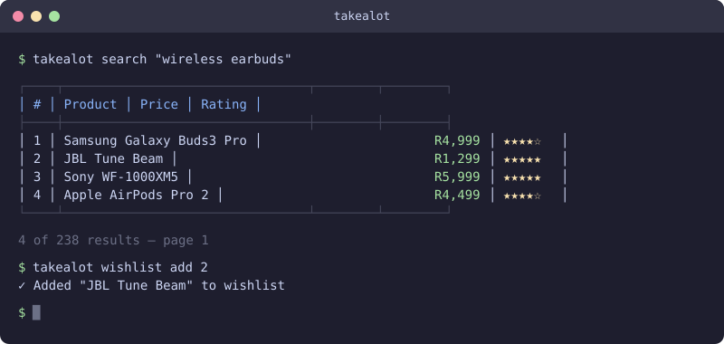

# 🛒 takealot-cli

**The Takealot store from your terminal, built for headless agents.**

[](https://github.com/yashiels/takealot-cli/actions/workflows/ci.yml)
[](LICENSE)
[](https://github.com/yashiels/takealot-cli/releases/latest)

Search the store, manage a cart and an account, and preview checkout from the command line. Read orders and invoices, handle returns and use the rest of the Takealot app that does not involve payment. The CLI talks directly to the Android mobile API. It has no browser dependency.

An agent can use every account feature that the CLI exposes, but it cannot place orders or pay. `checkout` is a read-only preview of the amount due and the incomplete sections. Give that preview to the account owner, who pays in the Takealot app.

Every data command supports `--json`.



## Install

```bash
brew install yashiels/tap/takealot
```

You can also download a standalone binary from the [latest release](https://github.com/yashiels/takealot-cli/releases/latest).

To build from source, use Node 18 or later:

```bash
git clone https://github.com/yashiels/takealot-cli.git
cd takealot-cli
npm install
npm run build
npm link
```

## Quick start

```bash
takealot search "protein powder" --json
takealot login
takealot info 52341565
takealot cart add --plid 52341565
takealot cart
takealot checkout
```

`cart add --plid` reads the product detail and finds the buyable SKU, also during a dry run. If the listing has variants and no single SKU, the command asks you to choose a variant. It does not guess.

## Authentication and device trust

The CLI saves credentials and tokens automatically. It stores the device id (`did`) that Takealot gives, together with the Android profile. When it has a `did`, it sends it on every authenticated request. After one 2FA login with device trust, later logins normally skip the OTP.

Credentials in the environment take priority over the stored pair:

```bash
TAKEALOT_EMAIL="$(op-sa read op://Agents/takealot/username)" \
TAKEALOT_PASSWORD="$(op-sa read op://Agents/takealot/password)" \
  takealot cart --json
```

A device that Takealot does not trust uses a two-step OTP flow with no prompts:

```bash
takealot login --json
# {"status":"otp_required","challenge":"<nonce>","otpSentTo":"…","expiresInSec":300}

TAKEALOT_OTP=123456 TAKEALOT_CHALLENGE=<nonce> takealot login --json
```

The second request sends the `__cf_bm` cookie from the challenge response again. Use the environment variables, because OTP flags on the command line can stay in shell history or the process list. Do not run `login --reset` without a person at the terminal. It asks for the email and password.

New credentials use the profile of Takealot Android 4.3.0, build 800751. An existing `credentials.json` keeps its stored device profile, so its trusted device identity does not change. To make the CLI create the current default, delete only the stored `device.profile` field.

## Command overview

All data commands accept `--json`. Use `--help` on a command group to see all its commands.

| Area | Commands |
|------|----------|
| Find | `search <query> [--limit]` · `autocomplete` · `trending` · `deals` · `info <plid> [--credit-options\|--bundle\|--card\|--reviews]` |
| Price history | `price history <product> [--since <window>] [--series] [--no-cache]` |
| Price watch | `watch add <product> [--target <rand>] [--drop <percent>]` · `watch add --from-wishlist <groupId>` · `watch list` · `watch check` · `watch rm <product>` |
| Reviews | `reviews <plid> [--page <n>] [--sort <key>]` · `myreviews …` |
| Recommend | `recommend layout [--location <location>] [--plid <id>]` · `recommend <location> --model <key> [--plid <id>] [--limit 10]` · `buy-again` |
| Cart | `cart` · `cart add <query>` · `cart add --sku <id>` · `cart add --plid <id>` · `cart set-qty` · `cart remove` · `cart basket` · `cart clear` |
| Checkout | `checkout` (read-only preview) · `checkout start` · `checkout submit --file <json>` for delivery or pickup choices |
| Wishlists | `wishlist list` · `wishlist items <groupId>` · `wishlist add <groupId> --sku <id>` · `wishlist move --from <id> --to <id> --tsin <id>` · `wishlist rm-items <groupId> --tsin <id>` |
| Cards and credits | `cards` (never shows card references) · `cards rm --last4 <dddd>` · `credits …` |
| Orders | `orders` · `orders show <id>` · tracking, cancel and reschedule commands · `invoices <orderId>` with its PDF, request, credit-note and business-detail commands |
| Account | addresses, returns, refunds, Plus, account and security, help and chat, config, and preferences |

`recommend layout` returns the model keys for `recommend <location> --model`. The locations are `home-page`, `pdp`, `add-to-cart`, `landing-page` and `domain`. A PDP request needs the product. Run `recommend layout --location pdp --plid <id>`, then `recommend pdp --plid <id> --model <key>`.

`invoices <orderId>` accepts the order number that `orders` shows. The CLI finds Takealot's internal order id before it calls the invoice endpoints.

`cart remove` and `cart set-qty` read the cart before and after the write. If a different line disappears or changes quantity, the command exits 1 and prints a restore command for each line.

### Price history

`takealot price history <product>` reads the price history from Serval. Serval usually records one price each day, but the history can have gaps. The last price can be stale. If Serval does not track the product, the command returns `not_tracked` with exit 4.

Use `--since 90d` to select a time window. Use `--series --json` to include the points in JSON output.

### Price watch

`takealot watch add <product>` adds a product to a local watchlist. It makes no request. `takealot watch check` gets price data from Serval. Run it once a day.

The `target` reason means that the price is at or below your target. The `drop` reason means that the price fell by the selected percentage. The `low` reason means that the price is at or below the earlier low in a history of at least 30 points.

The watchlist can hold 50 products. A check can make at most 50 HTTP attempts by default. Use `--max-requests` to set a lower limit. A check stops new requests when Serval returns HTTP 429 or 403.

### Writes and account-security changes

A command that changes state is a dry run until you add `--confirm`. Add `--yes` to skip the interactive prompt. An agent must get the owner's clear yes for the specific action before it uses `--confirm`. `--i-know` is a safety flag, not permission.

Account-security writes that can lock out the owner also need `--i-know`. These are password, email, mobile number, 2FA-disable and trusted-device removal operations.

```bash
takealot address use --file selected.json
takealot address use --file selected.json --confirm
takealot account password submit --file filled.json --confirm --i-know
```

Some writes use a form from the server and then a submit:

```bash
takealot account password form
takealot account password submit --file filled.json --confirm --i-know
```

The CLI compares the submit payload with the saved form before it sends the payload. Use `--file -` to read JSON from stdin.

## Checkout and payment boundary

`takealot checkout` reads the checkout and changes nothing. It returns items, subtotal, discounts, credits, total, amount due, shipping method and `sectionsIncomplete`, with `payInApp: true` in JSON. Human output ends with `Pay in the Takealot app.`

The CLI never creates an order and never pays. The API transport blocks order-completion, card-payment, 3DS, eBucks payment, and Takealot Plus payment or plan-change endpoints. `checkout --confirm` exits 4 before any network call.

## Output and errors

Machine-readable failures use this envelope on stdout:

```json
{
  "error": "human-readable message",
  "code": "stable_error_code",
  "status": 400,
  "method": "POST",
  "path": "/rest/v-1-18-0/customers/<id>/cart/items",
  "details": { "message": "...", "errors": [{ "field": "...", "message": "..." }] }
}
```

`status`, `method`, `path` and `details` appear when the API returned an error. `details` holds only the server message, code and field errors. The CLI masks email addresses and long numbers in it.

| Exit | Meaning |
|------|---------|
| `0` | Success, also a dry run |
| `1` | Runtime or API failure |
| `3` | Authentication or OTP failure |
| `4` | Usage error, blocked order or payment attempt, or an account state that makes the request impossible (`unavailable_state`) |

## Safety

- The transport allows only the exact `https://api.takealot.com` origin. It rejects redirects, unsafe URLs, and blocked order and payment paths.
- The CLI redacts secrets in all output by default. `--unsafe-raw` is for debugging, but `cards` still never returns card references.
- A product listing id (`PLID`) and a buyable SKU id are different numbers. The CLI does not use one in place of the other.
- The CLI uses no browser, Playwright or Puppeteer.

## Configuration

Files are in `~/.config/takealot-cli/`, or under `$XDG_CONFIG_HOME` when you set it:

| File | Contents |
|------|----------|
| `config.json` | API and user-agent overrides, and preferred brands |
| `credentials.json` | Email, password, tokens, and the device record (`did` and profile), mode `0600` |
| `preferences.json` | Preference cache built from order history |
| `pending-otp-*.json` | OTP challenge state, including the `__cf_bm` cookie, until the login completes or expires, mode `0600` |

The CLI writes each file in one atomic step. A lock stops two processes from changing the credentials at the same time.

## Preference engine

A text `cart add` ranks the results. The order is:

1. An item that you bought before.
2. A brand that you bought in the same category.
3. A preferred brand from `config.json`.
4. Title similarity.

Build the cache after login:

```bash
takealot preferences refresh
```

## Development

```bash
make ci
make build
make test
```

The Ship workflow makes each release. It sets the version, builds standalone binaries and tests the binary for its own platform. Then it publishes a GitHub Release and updates the Homebrew tap.

## Disclaimer

Takealot.com (Pty) Ltd does not endorse this tool, and the project has no link to the company. The tool calls private APIs that are not documented. These APIs come from the Takealot Android app and can change without notice. Use the tool only on your own account.

## License

MIT, [Yashiel Sookdeo](https://github.com/yashiels)
